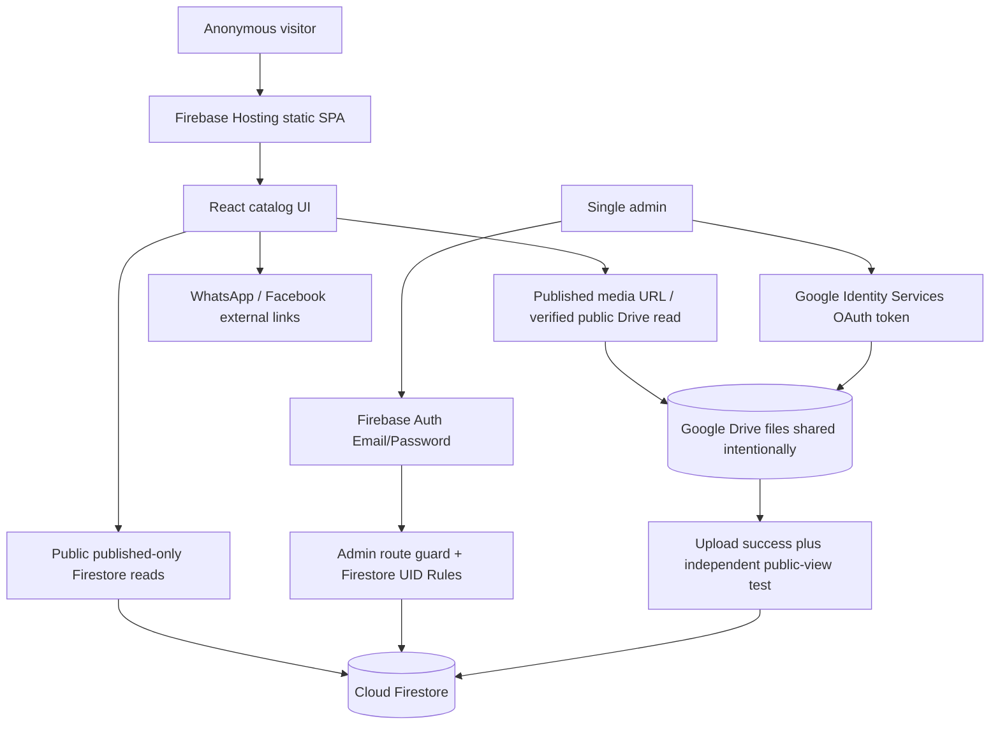

# Technical architecture — Souqna catalog

## Latest image-performance amendment — 2026-10-10

Browser compression now adapts WebP quality/dimensions to each image placement. The default uploads only the display copy; an optional checkbox archives the untouched original privately using the existing originals folder/model. GIF animation is preserved. Public image rendering reuses bounded short-lived memory/CacheStorage bytes after fresh authorized Firestore metadata reads, with four parallel tokenless image fetches, viewport deferral and priority for branding/detail covers. Publication/repair ignores cache and verifies a fresh Google response. No script deployment, public read-policy relaxation, new backend or paid service is required. See docs/08_DECISIONS_AND_OPEN_QUESTIONS.md for cache/revocation and first-read limits. This amendment supersedes earlier unconditional original duplication and memory-only byte reuse descriptions below.

## 1. Stack and boundaries

| Layer | Technology | Constraint |
|---|---|---|
| Front end | React + TypeScript + Vite | Static build, mobile-first, public and `/admin` routes |
| UI | Tailwind CSS + shadcn/ui (Radix), accessible headless components | shared theme tokens, bilingual layout, responsive |
| Navigation | React Router or equivalent well-maintained client routing | no SSR/backend required |
| Form/schema | React Hook Form + Zod (recommended) | enforce validation at UI **and** Rules |
| i18n | i18next/react-i18next (recommended) | all UI keys in `ar` + `en` |
| Unit tests | Vitest + Testing Library | pure pricing and interaction/state tests |
| Browser tests | Playwright recommended | viewport, theme, localization, guarded admin |
| Identity | Firebase Authentication — Email/Password | one administrator, no visitor accounts |
| Database | Cloud Firestore | publication gating, cursor queries, explicit indexes |
| Web hosting | Firebase Hosting on existing Spark project | do not switch to paid plan silently |
| Media originals and variants | Owner's Google Drive | only after public read POC succeeds |
| Drive upload authorization | Google Identity Services OAuth token model | admin browser only, scope drive.file |
| Google APIs | Google Drive REST API | token never sent to visitors |

## 2. Suggested repository layout (implementation target, not files already included)

```text
src/
  app/{providers,router,guards}/
  components/{common,layout,theme,forms,media}/
  features/
    catalog/{components,pages,queries}/
    products/{models,logic,components}/
    categories/{components,queries}/
    offers/{components,logic,pages}/
    contact/{links}/
    admin/{auth,dashboard,products,categories,offers,media,settings,drive}/
  integrations/{firebase,drive}/
  i18n/{ar,en}/
  styles/{tokens.css,globals.css}/
  utils/{money,time,validation,urls}/
  test/
firestore.rules
firestore.indexes.json
firebase.json
.env.example
```

Do not build all UI as one giant component. Shared `ProductCard`, `PriceDisplay`, `MediaGallery`, `OffersCard`, `ThemeToggle`, `LanguageToggle`, `ContactBar`, `AdminLayout` must be reusable across themes and locales.

## 3. Flow overview



## 4. Drive feasibility gate — prove before media-backed release

The original source calls public display from Drive the **critical unknown**. Implement a minimum proof with real authorized owner credentials, ideally before implementing extensive card/photo UI:

1. Sign in as allowlisted Firebase admin.
2. Connect Google via GIS OAuth Web Client with minimal `drive.file` scope; token held **in memory** only.
3. Create/select an app-accessible Drive folder via valid API/Google Picker flow; do not assume `drive.file` authorizes arbitrary existing folder content.
4. Upload a small actual image, ideally using tested resumable approach; get file ID and metadata. Keep selected original/optimized versions privately while not published.
5. Intentionally grant public readability to the **specific published file**, not the folder or entire drive. Document constraints for Workspace accounts prohibiting public sharing.
6. Attempt actual image-content rendering in **incognito / unsigned visitor** using a stable, CORS-compatible, publicly accessible route that does not contain the admin token or depend on expiring thumbnail links. Validate on expected web origin and across reload.
7. Distinguish `uploadPass` and `anonymousRenderPass` in UI/log. Do not report success unless both pass.
8. Test revoke permissions, unauthorized visitor, missing file, public sharing disabled, and expired browser session.

**If step 6 fails:** `BLOCKED_DRIVE_PUBLIC_MEDIA`. Preserve owner constraints and report the actual failed request/status with secure redaction. Do not silently route media through Storage, Functions, paid proxy, token-exposing frontend, or Drive preview-page link presented as working image. A demo placeholder may allow UI development while integration remains clearly blocked. Owner must approve any architecture change.

Drive image delivery and CORS behavior may differ by endpoint; do not make unverified claims from the appearance of example screenshots. `resourceKey` may be required for some shared files. Files larger than safe UI sizes need image optimization and lazy loading; creating derived assets still occurs in the admin browser and persists to Drive.

## 5. Authentication and authorization

- Firebase Authentication user identity is not equivalent to admin authorization; deployed Firestore Rules must explicitly check allowed `request.auth.uid`.
- Initial admins: one fixed UID configured during deployment (e.g., generated security rules using a controlled, reviewed UID entry). No public `roles/{uid}` self-service write.
- Don't embed passwords in config; client Firebase Web config is not a secret, but authorization is rules-based.
- Route guards improve UX; Firestore Rules protect data. Test direct reads and writes without authentication.
- Public content queries must include publication predicates (`status == 'published'`) compatible with Rules. Rules are not a hidden content filter.
- If special offers have date windows, enforce public eligibility with application logic and appropriate read policy; don't expose unpublished records.

## 6. Data access/query strategy

- Public catalog fetches `limit(12|24)` and uses cursor/startAfter; distinct queries for category/status, with Firestore indexes checked and included in source.
- Lists avoid `get()` of thousands of products. Admin product list also paginates.
- Search must have an explicit supported scope. Firestore does not provide complete full-text search. Options: category + normalized prefix tokens / bounded local filter with honest UX. Do not silently add Algolia/paid SaaS.
- Use `onSnapshot` only for narrowly scoped admin/public counters where worthwhile; otherwise paginate and cache per session.
- Denormalized media summaries may be used for cards, but authoritative media assets and references remain tracked.

## 7. Prices, currencies, dates

- Store money as integer minor units, format with `Intl.NumberFormat(locale, {style:'currency', currency})`; EGP default.
- Duration/discount computation happens in a tested pure function. Store UTC timestamps in Firestore; render schedules in `Africa/Cairo`.
- `unit` and `carton` discount targets are independent, carton absence means no carton discount. Ensure `0 <= finalMinor <= originalMinor` for valid discount; reject nonsensical input.
- `currency` changes label only in v1; show admin warning about reviewing all saved prices before relabel.

## 8. Contact routing / no purchase flow

- WhatsApp and Facebook only as **external inquiry** controls, validated and configured by admin. Build WhatsApp URL with encoded text e.g. `مرحباً، أريد الاستفسار عن {productName}: {URL}`.
- Do not create cart/order collections or client accounts. Do not infer "delivery" or "free shipping" from reference screens.
- Disable/omit broken contacts, avoid false URL in production.

## 9. Theme and localization

- CSS variables per theme, e.g. `html[data-theme='dark']`; persist user selection in localStorage (this is permitted; only **OAuth tokens** may not be persisted).
- Render desired theme before paint where feasible to avoid flash. Light initial default can be chosen; user choice always wins.
- Every screen must show a working theme switch, including splash, admin login, media and new CRUD pages.
- Central i18n dictionaries, document `lang`/`dir` flips, logical CSS spacing, form alignment and accessible labels in both languages.
- Content fallback if missing translation must be clear and consistent; don't show blank cards.

## 10. Operational and release constraints

- No implicit cloud deploy, paid services, Functions, Storage, new Firebase project or billing configuration.
- Local demo/preview may operate with sample data **clearly labeled DEMO**. A fake connected badge is unacceptable.
- Build/lint/typecheck/unit tests mandatory. E2E with Playwright for critical journeys; Firestore emulator integration checks where feasible.
- Deployment guide must distinguish steps Codex performed from human-only actions and test evidence. Hard gate blocks a production-ready claim if not proven.
# Owner amendment — 2026-10-08: Nexara-style Drive bridge

The owner explicitly requested the integration in D:/Projects/Nexera/Nexara. The default connection now uses the same Apps Script Web App workflow: Gmail field, /exec URL, ping/test-and-save, automatic folders, base64 upload in a text/plain POST, direct/view/download URLs and Firestore metadata. Firebase Auth/Firestore/Hosting remain unchanged. The previous GIS adapter is retained as an optional advanced connection for files above the bridge's application cap. Older GIS settings/assets remain readable.

Necessary documented differences from the reference: every bridge POST verifies the allowlisted administrator with Firebase accounts:lookup; project/audience/issuer/expiry/disabled/revoked-account checks run before Drive access. Only files inside the app root can be shared or revoked. Uploads/originals remain private until explicit sharing, and sharing failure is not swallowed. Anonymous public image proof still gates publication. The script template contains only public Firebase identifiers and the admin UID; ID tokens are sent per request, never saved in Drive settings/media or logs. No browser Google OAuth token, refresh token, client secret or service account is used by the bridge.

Apps Script runs in the deployment owner's Google account with DriveApp permissions, a broader owner-granted scope than the optional drive.file client. Google authorization/deployment remains an owner action. A stored successful ping is labeled as the last test, not a live health guarantee. Disconnecting the app's URL does not archive the Google deployment; the guide explains both actions.

Bridge uploads are a single base64 request, capped by this app at 20 MiB, not resumable; progress is indeterminate. Interrupted requests may have reached Drive: recovery checks the folder before retry. Google quotas/CORS/public-image responses require actual browser testing. The advanced adapter retains resumable 4 MiB chunks for larger files. No paid infrastructure was added.


## Latest owner amendment — 2026-10-08

This historical delivery description is superseded by the inline-media amendment below.

Google Apps Script is the only media connection. Remove the direct OAuth alternative and reference-project names from user-visible copy/generated code; do not ask for a browser Client ID or Drive API key. Per-file and configurable type limits are at most 20 MiB. Existing Firebase + owner Drive architecture and publication/private-original gates remain. Credential-free display probes use the observed tokenless Drive usercontent delivery endpoint for the same file ID; no expiring thumbnail, proxy or paid service. Historical direct-adapter notes above are superseded. Current implementation/evidence is in IMPLEMENTATION_STATUS.md.

## Inline image delivery amendment — 2026-10-09

The owner removes the standalone Media screen. The shared ImageField belongs in product galleries, store identity/logo, category covers and offer/banner images. Each field uploads directly, previews, replaces/detaches, repairs delivery and recovers incomplete uploads in its section. Files/metadata and usage references remain in the existing Drive/Firestore model. Private administrative documents/videos and original recovery are under the existing Drive setup screen; these do not become public catalog attachments.

Drive's direct download endpoint failed actual browser embedding with cross-site fetch metadata, even though direct-link access succeeded. The existing Apps Script bridge now provides protocol 2 GET `/exec?action=image&fileId=…`. It reads only an existing app-folder image already shared with anyone/the link. Private roots/subfolders, private files, originals, foreign files, unsupported types, oversized files and missing roots are rejected; reads never create folders or change sharing. Every POST still verifies the Firebase administrator before Drive access.

The response contains bounded MIME-validated image bytes as JSON through ContentService. The browser fetches without credentials or Authorization, follows Google's redirect and creates temporary Blob URLs, releasing them on cleanup. Firestore stores the permanent /exec image endpoint and Drive metadata, never bytes or credentials. Images load near the viewport; concurrent requests share an in-flight fetch. Native image rendering supports animated GIF display copies; GIF originals are saved separately and remain private. No additional hosted service, Firebase Storage/Functions, Google credential or billing change is introduced.

Publication remains gated on anonymous fetch and actual image decoding. Upload, metadata saving, sharing and verification are distinct failure points. Retries reuse known Drive file IDs; recovery deduplicates by Drive ID. Editor saving is disabled during image work. Removal detaches the image after saving; sharing revocation/metadata deletion remain restricted to unused assets. Read-only delivery and JSON redirects follow the [Google ContentService documentation](https://developers.google.com/apps-script/guides/content) and [Drive file sharing/blob API](https://developers.google.com/apps-script/reference/drive/file).

Catalog/store records still use live Firestore subscriptions. MediaImage reads asset metadata from the server on file-reference, authenticated user, store or content revision changes. Assets use separate immutable Drive IDs on replacement. This avoids keeping a listener on a detached asset whose metadata read permission is withdrawn during replacement; regression coverage proves an already-open unsigned visitor receives a replacement logo. Admin image controls retain live metadata status and refresh the preview after repair. Recovery preserves an existing display asset's originalMediaId relationship and current usage references.
